<link rel="stylesheet" href="index.css"><header class="container">
  
  <h1>Smart-Store</h1>
</header>
<body class = "secContainer">
Commercial Android app that created to allow users to shop online and to keep track of their order status using Bluetooth detection

## Technologies
* Android (min SDK) 16 - (target) 30
* Java 
* Retrofit + AsyncTask (deprecated)
* MVC design pattern
> please check app/build.gradle to refers to the dependencies $version.

## Get Started
Download or clone the project:
```bash
https://github.com/Houssem-Esprit/SmartStore.git
```

> Make sure to clone the backend servers [here](http://github.com).

## Screenshot


 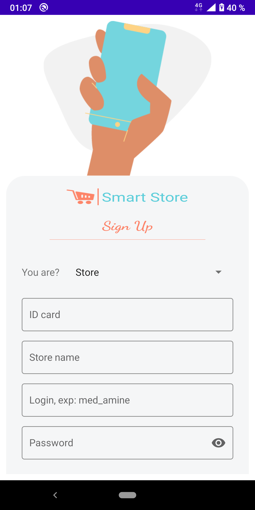
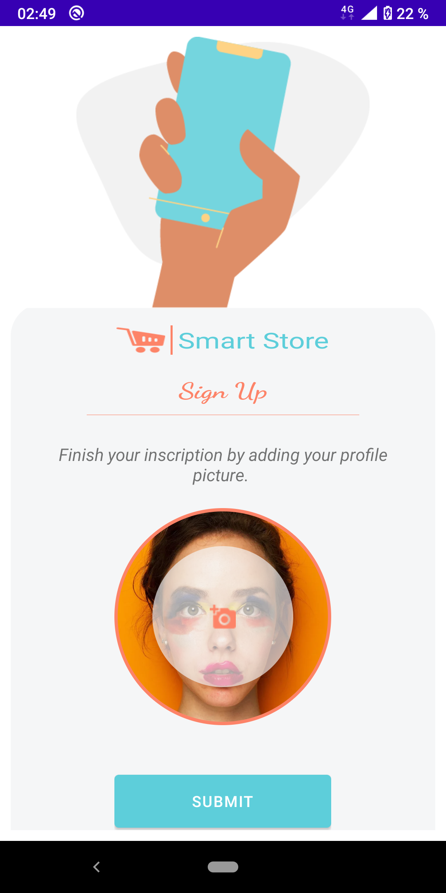 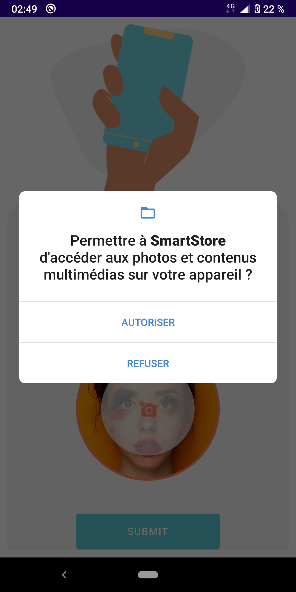
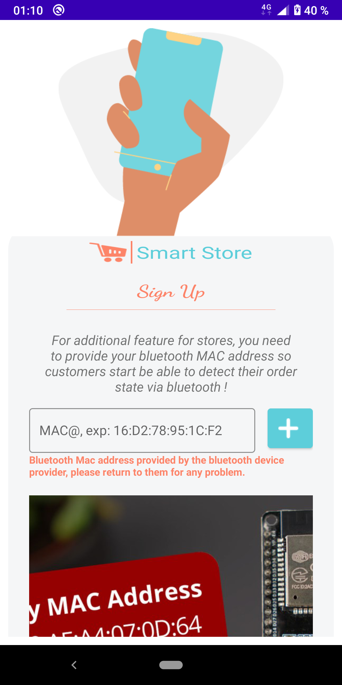 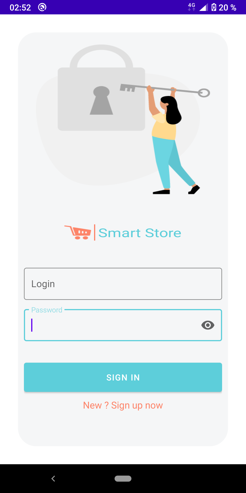
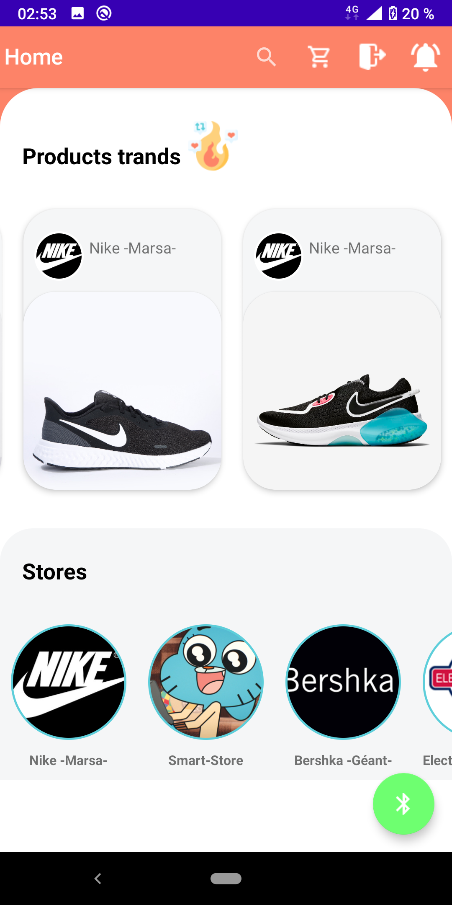 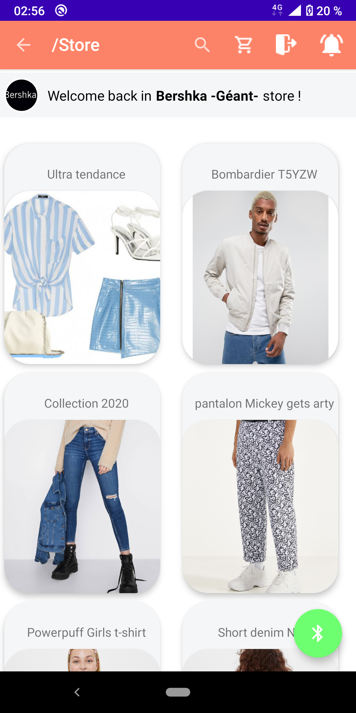
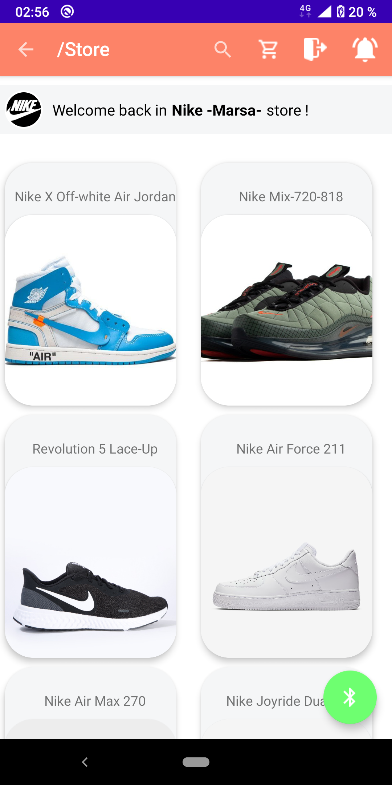 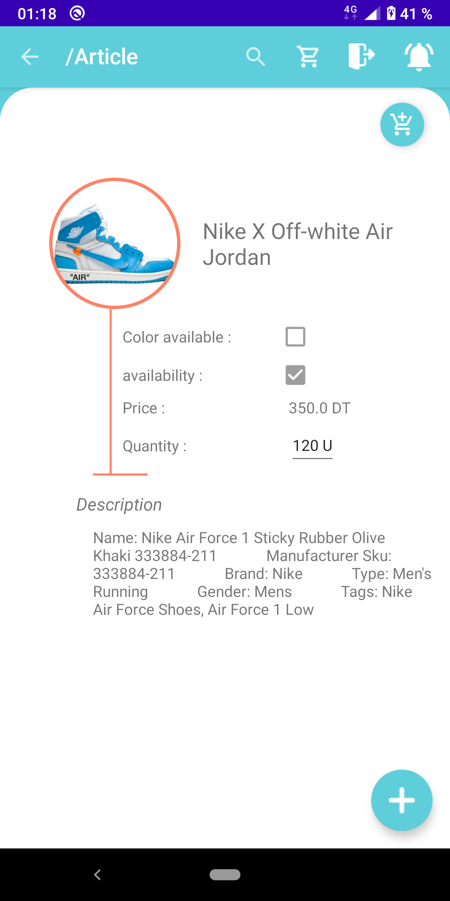
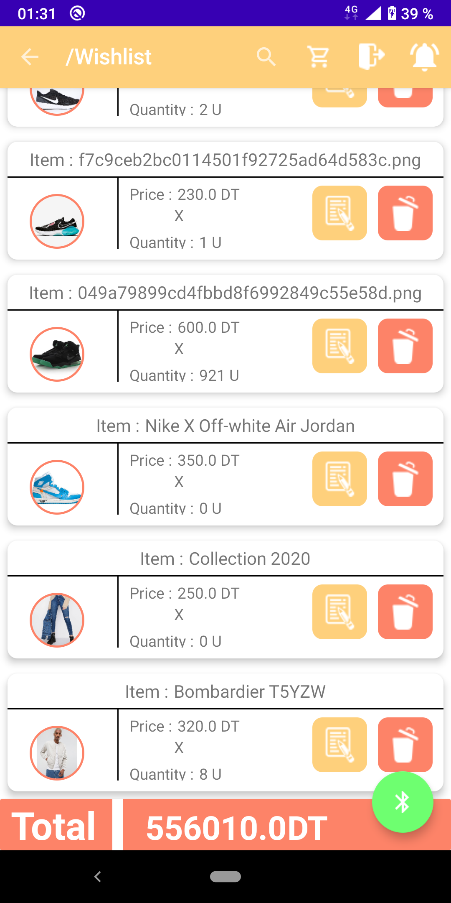 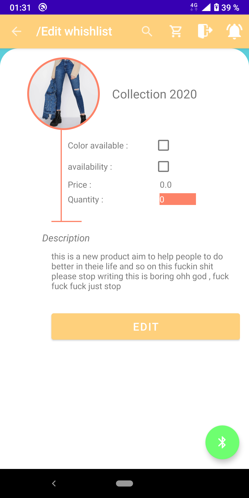
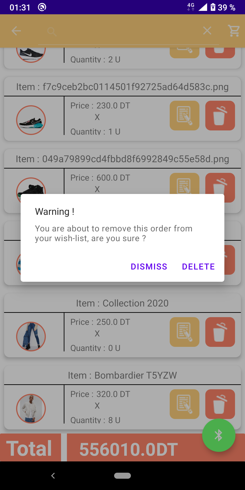 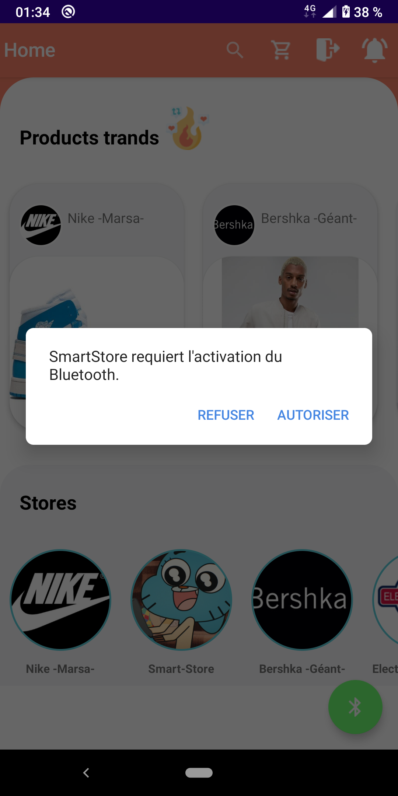
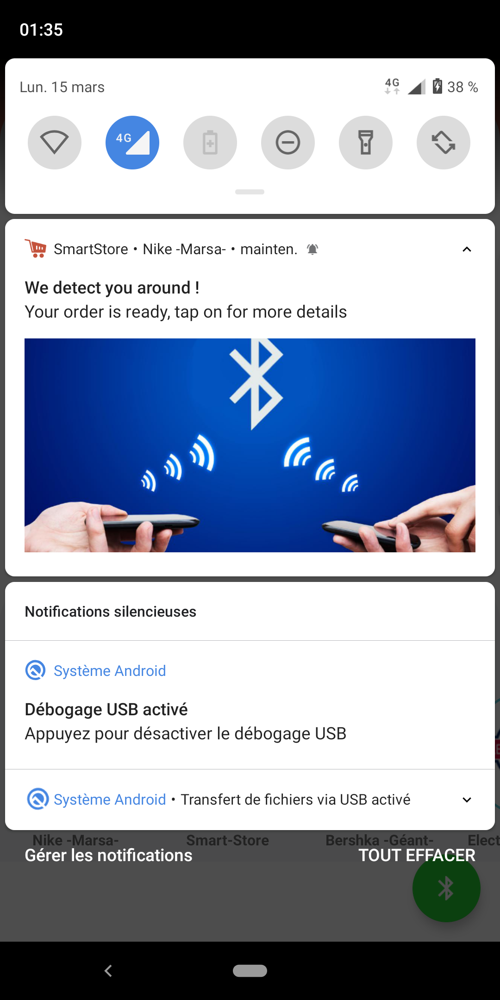 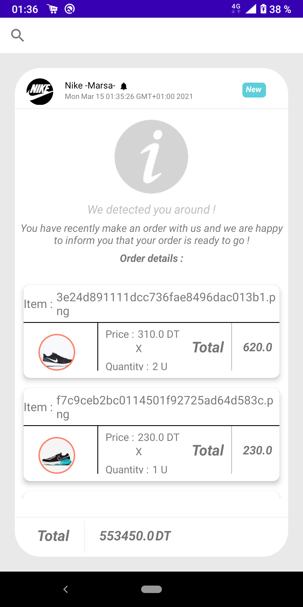
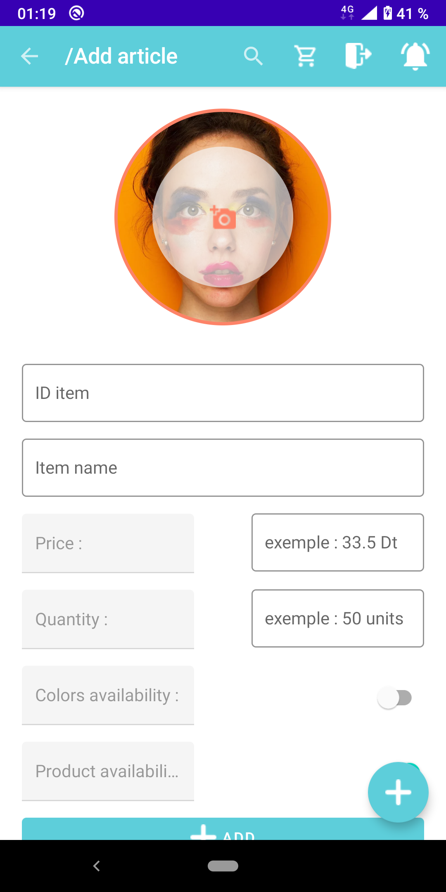 x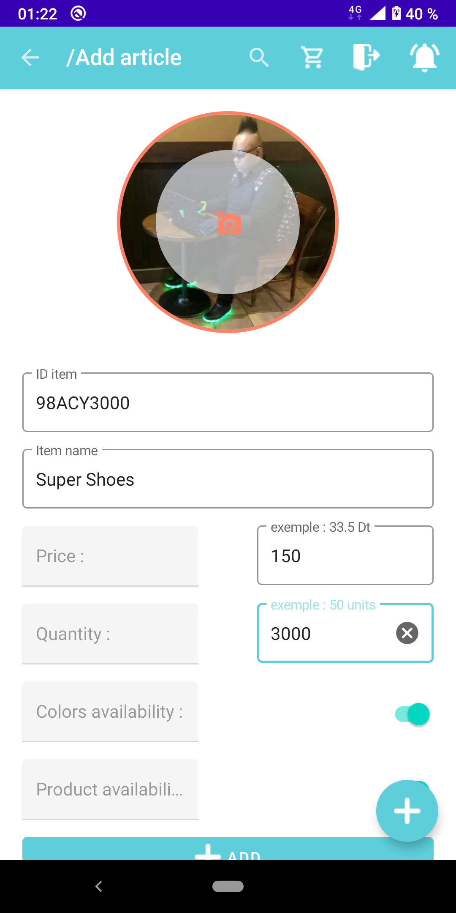


</body>
